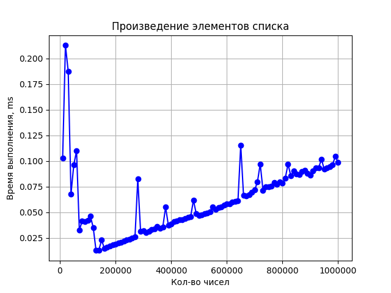

# NumberOperations

## Использование

Для запуска программы выполните следующую команду:

```sh
java NumberOperations.java <file_numbers_path>
```

## Выходные данные
- **Min:** минимальное значение
- **Max:** максимальное значение
- **Sum:** сумма значений
- **Multiply:** произведение значений

## Тесты
Тесты покрывают следующие сценарии:
- Минимальное значение в наборе чисел (`Min numbers`)
- Максимальное значение в наборе чисел (`Max numbers`)
- Сумма значений в наборе чисел (`Sum numbers`)
- Произведение значений в наборе чисел (`Multiply numbers`)
- Минимальное значение при пустом списке (`Min with empty list`)
- Максимальное значение при пустом списке (`Max with empty list`)
- Сумма значений при пустом списке (`Sum with empty list`)
- Произведение значений при пустом списке (`Multiply with empty list`)

## Графики производительности



